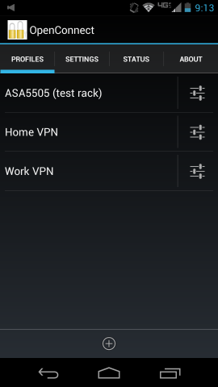
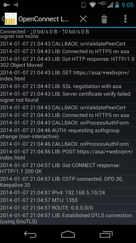
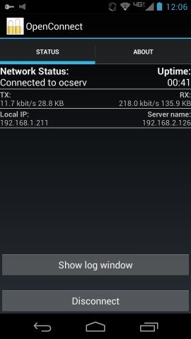
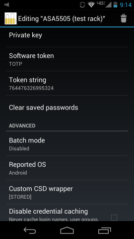

OpenConnect for Android
=======================

This is a VPN client for Android, based on the Linux build of
[OpenConnect](http://www.infradead.org/openconnect/).

Much of the Java code was derived from [OpenVPN for Android](https://play.google.com/store/apps/details?id=de.blinkt.openvpn&hl=en) by Arne Schwabe.

OpenConnect for Android is released under the GPLv2 license.  For more
information see the [COPYING](COPYING) and [doc/LICENSE.txt](doc/LICENSE.txt)
files.

Changelog: see [doc/CHANGES.txt](doc/CHANGES.txt)

To help out with translations, please visit
[this project's page on Transifex](https://www.transifex.com/projects/p/ics-openconnect/).

## Downloads and support

Official releases are posted in the [XDA thread](http://forum.xda-developers.com/showthread.php?t=2616121) and on [Google Play](https://play.google.com/store/apps/details?id=app.openconnect).

Binary APK files are also available at [F-Droid](https://f-droid.org/repository/browse/?fdid=app.openconnect).

No registration is required to download from XDA or F-Droid.

## Screenshots

&nbsp;

&nbsp;

## Building from source

### Prerequisites

On the host side you'll need to install:

* Android SDK in your $PATH (both platform-tools/ and tools/ directories)
* $ANDROID\_HOME pointed at the Android SDK directory
* javac 1.8 and a recent version of Apache ant in your $PATH
* Use the Android SDK Manager to install API 19
* NDK r16b, nominally unzipped under /opt/android-sdk-linux\_x86/
* Host-side gcc, make, etc. (Red Hat "Development Tools" group or Debian build-essential)
* git, autoconf, automake, and libtool

### Compiling the external dependencies

Building OpenConnect from source requires compiling several .jar files and
native binaries from external packages.  These commands will build the binary
components and copy them into the appropriate library and asset directories:

    git clone https://github.com/cernekee/ics-openconnect
    cd ics-openconnect
    git submodule init
    git submodule update
    make -C external

This procedure only runs on a Linux PC.  If you are unable to build from
source, you can try fetching the cached artifacts from a recent CI build:

    ./misc/download-artifacts.sh

### Compiling the app

After the binary components are built, this compiles the Java sources into
an APK file:

    cd ics-openconnect
    ./gradlew assembleDebug

To install the APK on a device:

    adb install -r app/build/outputs/apk/debug/app-debug.apk

Logs of successful (and not-so-successful) builds can be found on this project's
[Travis CI page](https://travis-ci.org/cernekee/ics-openconnect).
